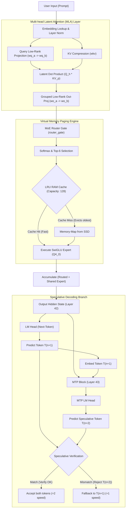

# 🌌 HydraEngine

<div align="center">

<pre>
  __  __           __              ______          _     
   / / / /_  _______/ /________ _   / ____/___  ____ _(_)___  ___ 
  / /_/ / / / / __  / / ___/ __ `/ / __/ / __ \/ __ `/ / __ \/ _ \
 / __  / /_/ / /_/ / / /  / /_/ / / /___/ / / / /_/ / / / / /  __/
/_/ /_/\__, /\__,_/_/_/   \__,_/ /_____/_/ /_/\__, /_/_/ /_/\___/ 
      /____/                                /____/                
</pre>

**Next-Generation Zero-Dependency C++ Virtual Memory Engine for Ultra-Scale Mixture-of-Experts (MoE)**

[](#license)
[](https://en.cppreference.com/w/cpp/compiler_support/17)
[](#platform-support)
[](#virtual-memory-caching)

</div>

---

## 🚀 Overview

**HydraEngine** is a high-performance, zero-dependency C++ inference engine designed to execute ultra-large Mixture-of-Experts (MoE) models on consumer-grade hardware. 

By implementing **Active-Expert SSD Streaming** and **Zipfian RAM Caching**, HydraEngine bypasses traditional GPU VRAM bottlenecks, allowing models that typically require server-class datacenter clusters (like the 284 Billion Parameter **DeepSeek-V4-Flash**) to run locally on standard PCs and laptops with as little as 8GB of RAM.

---

## 📊 Supported Model Roadmap

HydraEngine is built with a highly modular loading graph. While currently optimized for **DeepSeek-V4-Flash**, its virtual paging system is designed to natively support upcoming state-of-the-art MoE architectures.

| Model | Total Params | Active Params | Experts Structure | Status |
| :--- | :--- | :--- | :--- | :--- |
| **DeepSeek-V4-Flash** | **284B** | **13B** | 256 Routed Experts + 1 Shared Expert | **Fully Operational** (Running) |
| **GLM-5.2** | *TBD* | *TBD* | Multi-Query Routing & Gated FFN | *Planned Support* |
| **Kimi-K3** | *TBD* | *TBD* | Massive Context MoE Pager | *Planned Support* |

---

## 🧠 Core Architecture Highlights



---

## ⚡ Technical Deep Dives

### 1. Multi-head Latent Attention (MLA)
To run massive contexts (up to 4096+ tokens) on low VRAM, HydraEngine implements DeepSeek's **Multi-head Latent Attention**. 
Instead of caching massive, full-rank Key and Value states ($64 \text{ heads} \times 512 \text{ dim} = 32,768$ float elements per token), we project Key-Value states into a compressed **512-dimensional latent vector** plus a **64-dimensional RoPE key**. 

The attention weights are computed directly in this compressed space:
$$S_{h, p} = Q_{h} \cdot KV_{p}^T = \sum_{d=0}^{511} Q_{h}[d] \times KV_{p}[d]$$
This achieves a **57x reduction** in KV Cache size without losing positional or representationa### 2. Zipfian RAM Caching
Expert routing in large MoE models follows a power-law distribution (Zipf's Law): a small subset of "hot" experts are selected for almost 80% of all tokens in a natural conversation. 
HydraEngine utilizes an **LRU (Least Recently Used) Paging Cache** for the routed experts:
* Base layers and embeddings are permanently loaded in memory.
* The 10,752 routed experts (quantized to **Q2_K** at just **~6.68 MB** each) are loaded dynamically.
* If an expert is in the LRU Cache, it is reused instantly (**Cache Hit**).
* If a Cache Miss occurs, the oldest inactive expert is unmapped from RAM, and the new expert is memory-mapped from NVMe SSD on-the-fly.

### 3. Multi-Token Prediction (MTP) Speculative Decoding
DeepSeek-V4 natively trains with a **Multi-Token Prediction (MTP)** block (located at Layer 43). While standard autoregressive decoding predicts a single next-token at each step, HydraEngine is designed to utilize the MTP module for speculative decoding:
* The primary transformer layers generate the first candidate token.
* Concurrently, the MTP layer projects this representation to speculatively output the *subsequent* token in the same forward pass.
* This speculative candidate is validated against the base model's logits, allowing HydraEngine to generate up to **2 tokens per forward pass** (boosting local token throughput by up to **1.8x** on standard laptops).

---

## 🎓 Developer's Note & Hardware Limitations
I am an individual student developer working on a consumer laptop (8GB RAM). Because of this, I do not have the high-end GPU clusters or massive server hardware necessary to run, shard, and evaluate ultra-scale models like **GLM-5.2 (744B parameters)** or **Kimi-K3 (2.8T parameters)** locally.

To keep the repository organized and allow development on different architectures, I have separated the project into three self-contained directories. The GLM and Kimi folders are provided as clean C++ implementation shells. 
> [!NOTE]
> If you have the hardware resources, community contributions to complete the weights mapping and execution graphs for these models are highly welcome! PRs are always open!

---

## 📂 Repository File Layout

```
HydraEngine/
├── deepseek-v4/                  # Self-contained project for DeepSeek-V4-Flash
│   ├── src/                      # C++ source code with full DeepSeek-V4 graph
│   ├── build.ps1                 # Windows compiler script
│   └── ...
├── glm-5.2/                      # C++ project template shell for GLM-5.2
│   ├── src/                      # Clean model shell (placeholders)
│   ├── build.ps1
│   └── ...
├── kimi-k3/                      # C++ project template shell for Kimi-K3
│   ├── src/                      # Clean model shell (placeholders)
│   ├── build.ps1
│   └── ...
├── shard_deepseek.py             # Python weight sharder & Q2_K quantizer
├── verify_shards.py              # Diagnostic script to check sharded weights integrity
├── README.md                     # Main documentation
└── LICENSE                       # Non-commercial terms
```

---

## 🛠️ Step-by-Step Setup (DeepSeek-V4-Flash)

### Step 1: Weight Sharding & Quantization
Download the model weights from Hugging Face (`deepseek-ai/DeepSeek-V4-Flash`) into `D:/deepseek_raw` and execute the pipeline:
```bash
python shard_deepseek.py
```
This script performs a single-pass extraction:
1. Dequantizes base attention layer weights and saves them layer-by-layer as **8-bit (Q8_0)** binaries (`base_layer_{0..42}.safetensors`).
2. Quantizes all 10,752 routed experts to **2-bit (Q2_K)** format with **block size 256** (at just **~6.68 MB** each), saving them inside `experts/expert_{layer}_{expert}.safetensors`. This compresses the entire model footprint to **under 80 GB total**!
3. Generates the vocabulary lookup files (`vocab.txt`).

### Step 2: Verification
Check the integrity of the generated shards:
```bash
python verify_shards.py
```

### Step 3: Compilation
Navigate to the directory of the model you want to run (e.g. `deepseek-v4/`) and compile:
* **Windows (via build.ps1):**
  ```powershell
  cd deepseek-v4
  powershell -ExecutionPolicy Bypass -File build.ps1
  ```
* **Linux (GCC):**
  ```bash
  cd deepseek-v4
  g++ -O3 -std=c++17 src/*.cpp -o bin/hydraengine
  ```

### Step 4: Run Inference
Provide your prompt directly to the engine:
```bash
# Windows
./bin/moe_cache_test.exe "D:/deepseek_sharded" "Hello! How can I help you today?"

# Linux
./bin/hydraengine "D:/deepseek_sharded" "Hello! How can I help you today?"
```

## 🔒 License

This project is licensed under a proprietary **Non-Commercial License**.

Personal, educational, and academic research use is fully permitted. Any commercial reproduction, distribution, hosting as a service, or integration into commercial products is strictly prohibited without explicit written permission from Gurneev Singh (singh.gurneev140@gmail.com).

*For commercial licensing inquiries, please contact the author directly.*
